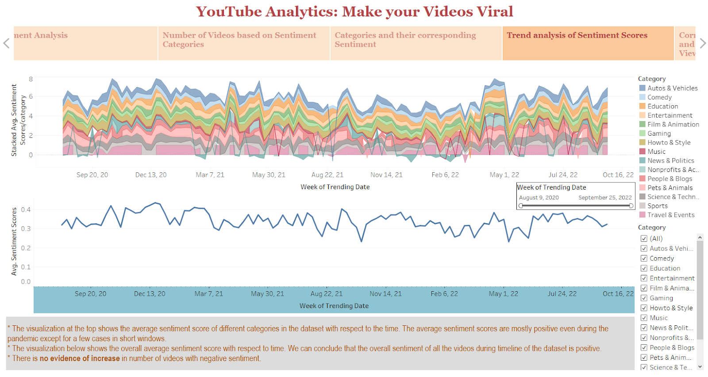
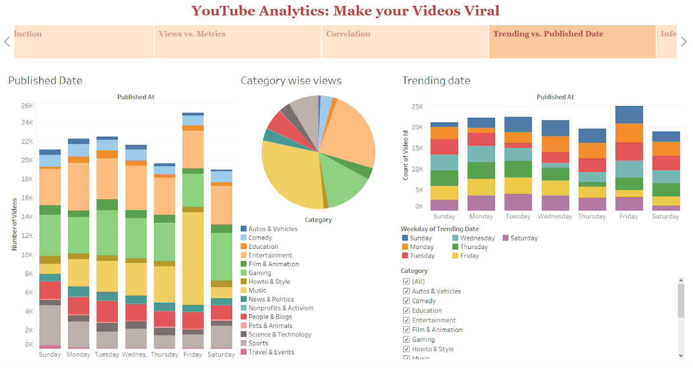
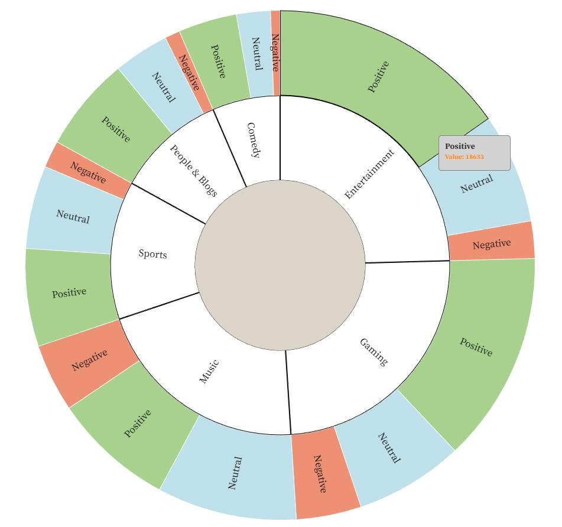
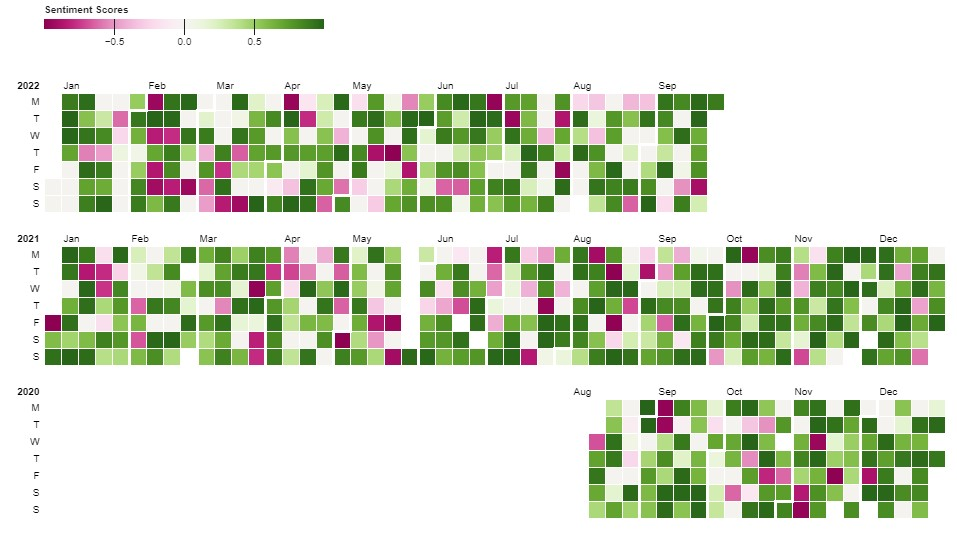

# YouTube Trending Video Analytics

The repo consists of visualizations in D3.js (Observable) and Tableau for videos from YouTube's [API](https://developers.google.com/youtube/v3/docs/videos/list) for trending videos in the US. Refer to this [repository](https://github.com/mitchelljy/Trending-YouTube-Scraper) to scrape data using the public API. The visualizations are created using raw statistics from the dataset, along with derived attributes like sentiment scores to gain more insight.

## Motivation
* Visualizations on trending YouTube video data that help narrow down key indicators that makes a video popular, and helps stay on YouTube's trending list. 

* What makes trending YouTube videos more engaging than others? How can content creators better make use of data to create high-performing videos that go viral? 

## Dataset
Download the CSV file for the dataset from [here](https://drive.google.com/file/d/1Wl5EkJOUrZGluVk_wjn1itU-sNQuS7LF/view?usp=share_link).

This is a cleaned version of the scraped data, and NLTK's [SentimentAnalyzer](https://www.nltk.org/howto/sentiment.html) is used to derive sentiment scores (ranging from -1 to 1) for videos, which are added to the CSV file as an additional feature.

Each entry in the dataset corresponds to trending videos (2020 to 2022) with features such as the
title,
trending date,
published date,
channel title,
category,
tags,
description,
views,
likes,
dislikes,
comments, and
comment count.

## Visualizations
* Net popularity vs. sentiment score
* Category based interactive visualization
* Category-wise analysis of sentiment scores
* Trend analysis of sentiment scores
* Correlation for raw video statistics ...

For more details on these visualizations and helper scripts, go to ```misc/```

Follow the steps given below to run the Observable notebook.

The Tableau visualizations can be found [here](https://drive.google.com/file/d/1iSfxo9yspFrkLw5WSwk74EVT9wo0p7il/view?usp=share_link).

Screenshots for sample visualizations are shown below.

|  |
|:--:| 
| *Trend analysis of sentiment scores* |

|  |
|:--:| 
| *Trend analysis of sentiment scores* |

|  |
|:--:| 
| *Sentiment category distribution for top-n categories based on popularity* |

| 
|:--:| 
| *Average sentiment scores trend (per day)* |

## Observable
To run the Observable notebook, upload the CSV file to the notebook

https://observablehq.com/d/dbd2e89e6a968b57@790


Alternatively, clone the repo and view this notebook in your browser by running a web server in this folder. For example:

~~~sh
npx http-server
~~~

Or, use the [Observable Runtime](https://github.com/observablehq/runtime) to
import this module directly into your application. To npm install:

~~~sh
npm install @observablehq/runtime@5
npm install https://api.observablehq.com/d/dbd2e89e6a968b57@790.tgz?v=3
~~~

Then, import your notebook and the runtime as:

~~~js
import {Runtime, Inspector} from "@observablehq/runtime";
import define from "dbd2e89e6a968b57";
~~~

